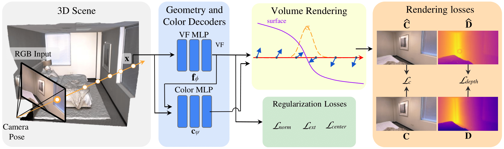

# VF-NeRF: Learning Neural Vector Fields for Indoor Scene Reconstruction




## Description

This repository contains the implementation of VF-NeRF: a neural volume rendering method that makes use of Vector Fields to represent indoor scenes. We learn the representation from multi-view posed images and their monocular depth maps.

## Table of Contents

- [Installation](#installation)
- [Usage](#usage)
- [Contributing](#contributing)
- [License](#license)
- [Contact](#contact)

## Installation

Clone project and pull LFS files (```git lfs pull```)

### Environment

This code has been tested with python 3.9, pytorch 1.10.0 and CUDA 11.3. To install the virtual environment run.
```
conda env create -f environment.yml
cond activate vf_nerf
```

Note: for a faster installation, consider installing mamba and change conda for [mamba](https://mamba.readthedocs.io/en/latest/installation/mamba-installation.html) in the above commands.


Installation without conda/mamba:
```
python3 -m venv vf_nerf
pip install -r requirements.txt
```


### Dataset loaders
The dataset loaders are located in [./datasets/normal_datasets](./datasets/normal_datasets). The folder contains a base class and two dataloaders for the replica and the scannet datasets. 

### Networks

The models are located in [./models/vector_field](./models/vector_field). Bith the vector field network and the rendering network are located there.

### Losses
The losses are located in [./models/losses](./models/losses). The file [vf_loss.py](./models/losses/vf_loss.py) contains the losses used by our method.

### Density
The density functions are located in [./models/helpers/density_functions.py](./models/helpers/density_functions.py). One can add a new density here, all of them inherit from the base class. Parameters can be added (they should also be added in the config implementation).

### Config

The config dataclasses are located in [./config_parser/vf_nerf_config.py](./config_parser/vf_nerf_config.py) and [./config_parser/joint_opt_config.py](config_parser/joint_opt_config.py). This configs manage the parameters set in the [config files](./confs).

### NeRF
The main model for VF-NeRF is located in [./models/nerf/vector_field_nerf.py](./models/nerf/vector_field_nerf.py). It contains all the important elements of the model (networks, density, annealing, optimizer, sampler). The main function is render, and it contains the inference of the network to render the color and normals of a batch of rays. If one wants to change the density for example, it needs to call the constructor of the new density in this file.

### Trainers
The main trainer for the whole optimization is [./train/vector_field_nerf_train.py](./train/vector_field_nerf_train.py). The loss, forward and backward part are called in this files.

## Training
To train a model from scratch, first one should download the datasets and put them under ```./data```. Then, adjust the [config files](./confs) as wanted. Make sure to st the correct dataset name (replica or scannet) and the name of the directory (Replica or ScanNet) in the dataset config in [./confs/vf_nerf.conf](./confs/vf_nerf.conf). Additionally, set your desired loss weights.

Then run:

```
# Euler append # isort:skip
python  --scene [scene_name] --expname [experiment_name]
```
Options:
```
--scene: for replica it is office0, room1, etc. For scannet it is scene0050_00, scene0084_00, etc.
--config_path: specify the config path for vf_nerf. Useful for when resuming an experiment.
--gpu: default is auto (uses GPU if available), specify cpu if you don't want to use GPU.
--expname: eihter replica or scannet.
--timestamp: if you want to resume an experiment, set the timestamp of the experiment you want to resume here.
--checkpoint: if resuming, define from which checkpoint, set to latest for the last checkpoint.
--offline: set this flag to disable wandb (recommended in euler).
--data_root_dir: path to data dir, by default it is set to ./data
```

The experiments are saved in a folder called exps_vf_nerf/[expname]_[scene]/[timestamp]. The checkpoints and the config will be stored there.

## Evaluation
To evaluate a model, run:

```
python evaluation/evaluate.py --method [evaluation_method] --scene [scene_name] --config_path [path_to_config] --expname [experiment_name] \
--timestamp [experiment_timestamp] --checkpoint [experiment_checkpoint] 
```

Options:
```
--method: evaluation method. Do render-images, then quadrant-marching-cubes-mesh and finally 3d-metrics to get the TSDF mesh and the quantitative results.
--resolution: MC resolution, default is 256.
--gpu: default is auto (uses GPU if available), specify cpu if you don't want to use GPU.
--eval_folder: Folder where the evaluation is saved. Default is evals_vf_nerf.
--chunk_size: chunk size for inferencing the model, default is 1024 rays.
--distance_thresh: threshold for precision, recall and F-score, default is 0.05.
--num_quadrants: Number of quadrant for the MC, default is 8.
--data_root_dir: path to data dir, by default it is set to ./data
```

## License

This project is licensed under the [MIT License](LICENSE).

## Contact

If you have any questions or want to get in touch, please don't hesitate to reach me at [albertgassol1@gmail.com](mailto:albertgassol1@gmail.com).
